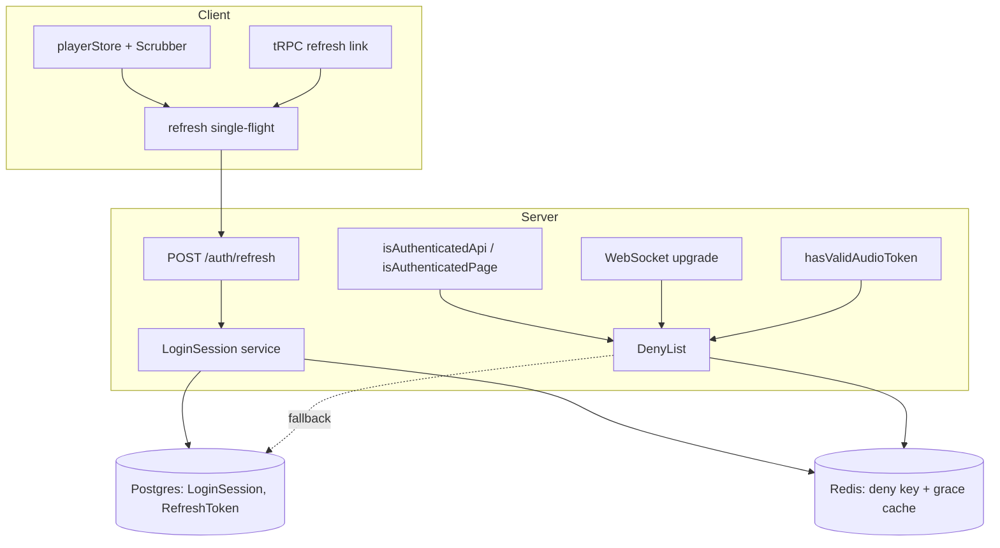
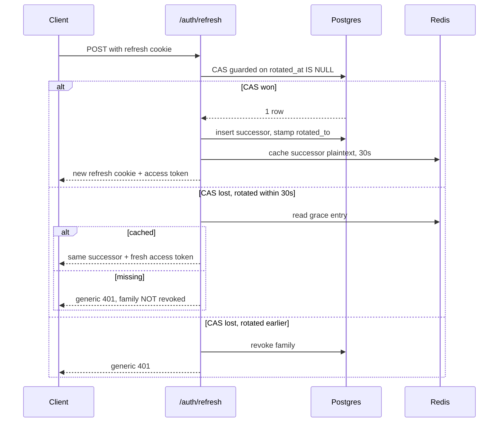
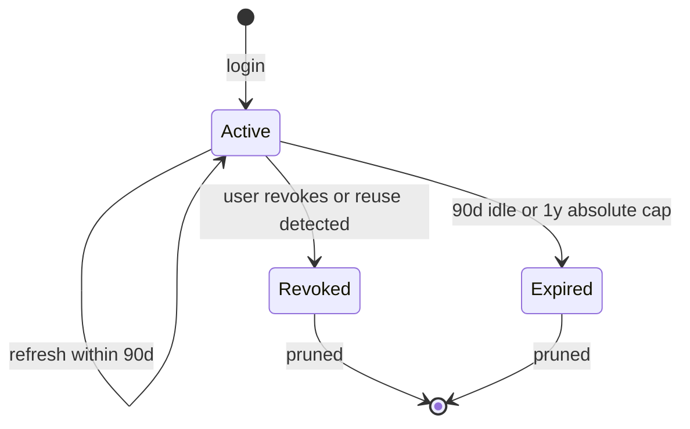
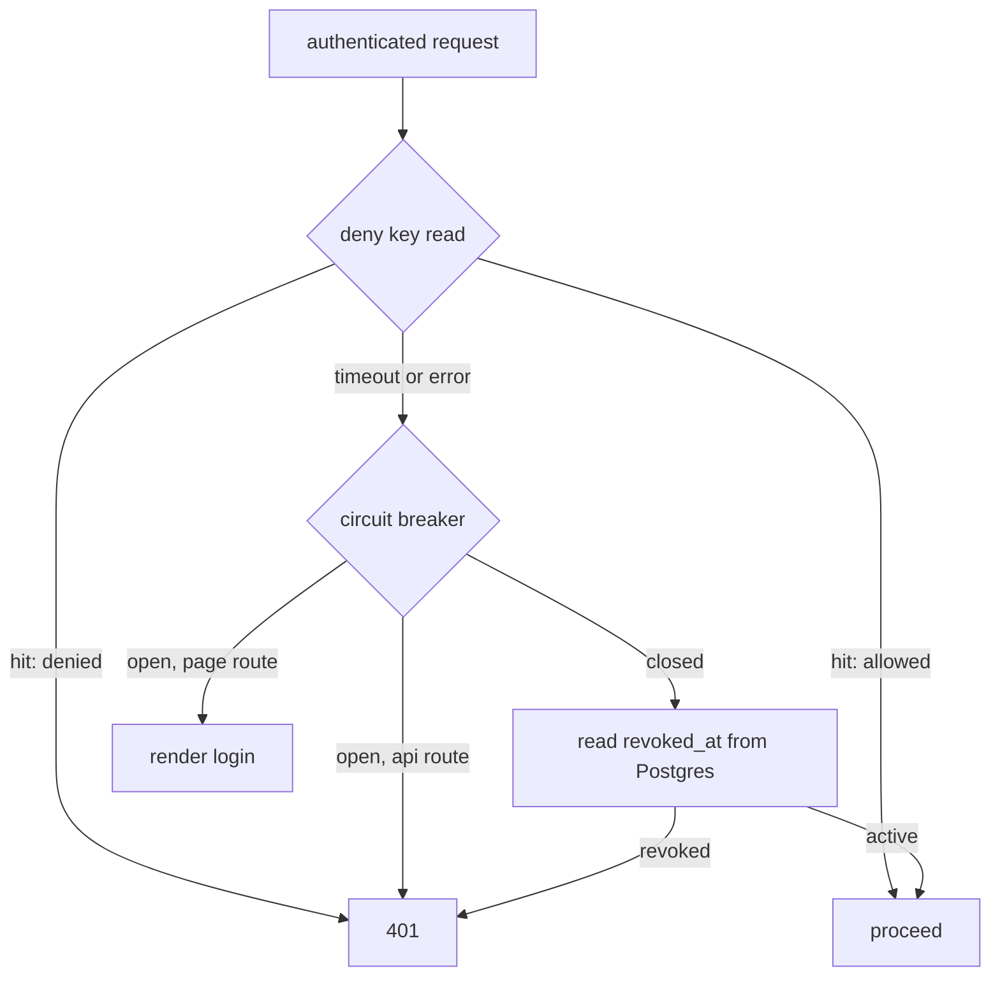

# Persistent Login Sessions - Plan

## Goal Capsule

**Objective:** Replace Chill's 6-hour JWT-only session with rotating refresh tokens backed by a revocable server-side login session, so a user logs in once and stays logged in, and so a long playlist keeps playing across days.

**Authority hierarchy:** `docs/adr/0009-persistent-login-sessions.md` owns the decisions; this plan owns how they are built. Where the two disagree, this plan wins on mechanism and the ADR wins on intent. `CLAUDE.md` conventions override both on style. `docs/glossary.md` owns the vocabulary — use *login session*, *device session*, *access token*, *refresh token*, *token family*, *reuse detection*, and *deny key* exactly as defined there.

**Execution profile:** U1-U5 are additive and can land independently. U6 and U11 together are the atomicity boundary — a tree with the new verification but the old cookie scheme has no working auth. U6 also carries the deletion of the old blacklist, which must not happen before every reader is switched over.

**Stop conditions:** Stop and surface rather than guess if (a) the `LoginSession` migration cannot be authored against the Dockerized Postgres from the host, (b) the iOS audio-unlock gesture cannot survive an awaited refresh in U7, or (c) replacing `req.user` (see KTD16) turns out to need a shape no token payload can honestly satisfy.

**Tail ownership:** This plan does not own the commit, PR, or deploy. It ends when the Definition of Done is met on a working tree.

---

## Product Contract

### Summary

Give Chill a login that survives PWA eviction, OS restarts, and month-long gaps, without giving up the ability to kill a device instantly. A rotating opaque refresh token in a path-scoped cookie mints short-lived access tokens; a `LoginSession` row is the durable unit of revocation; a Redis deny key makes revocation take effect on the session's next request.

### Problem Frame

The reported symptom was "I get logged out too often." ADR-0009 found four separate defects behind it: a session cookie with no `maxAge`, an HTML redirect where a 401 belonged, a permanently-cacheable `301`, and a 6-hour ceiling. Only the fourth is what a refresh token addresses.

The security reasoning that shapes this work is that access-token TTL was never the defence against a stolen device — a thief holding the phone lets the app refresh itself. Revocation is the defence. Once revocation is instant, TTL is left bounding only an access-token-only leak and the blast radius of the deny key failing, which is why a lifetime measured in hours is defensible where a banking app would not tolerate it.

Two properties of the app constrain everything. Cover art is a bare `` in five places plus one CSS `url()` background, and playback is a bare `Audio` element — none of them can retry a failed request from inside the request path, so every shortening of the TTL multiplies silent breakage. And strict reuse detection cannot distinguish a genuine replay from a client retrying after a lost response, so rotation frequency is a race surface.

### Requirements

**Session lifetime and refresh**

- R1. A user who logs in once stays logged in on that device without re-authenticating, until they revoke the session, 90 days of inactivity elapse, or one year passes from the original login. Both expiries are enforced at refresh, so an access token minted just before a boundary stays valid for its remaining life.
- R2. A refresh whose response never reaches the client does not log the user out.
- R3. A playlist longer than the access token's lifetime keeps playing across multiple day-long listening sessions without interruption.
- R4. Loading a playlist, idling 24 hours, and resuming playback works without a manual reload or a re-login.
- R5. Playback that fails on a dead token recovers without user action.

**Revocation and visibility**

- R6. A user can see every device their account is logged in on, each with a server-derived label, a creation time, and a last-refreshed time.
- R7. Revoking a login session ends API access, WebSocket control, and Chromecast streaming for that device.
- R8. A revocation is durable once the login session row records it. A revocation the server cannot durably record reports failure.
- R15. Revocation stays enforced across a cache restart and a cache outage. Neither silently re-admits a revoked session.

**Security posture**

- R9. A refresh token is single-use: presenting an already-rotated token outside the grace window revokes its entire family.
- R10. A read of the database does not yield usable refresh credentials.
- R11. An access token and a cast token are not substitutable for one another.
- R12. A dead token produces a machine-readable error on API routes and never a cacheable permanent redirect.
- R13. Repeated presentation of a dead refresh token cannot force repeated logouts or consume unbounded server resources.
- R16. Administrative privilege is read from the database at the point of use, never from a long-lived token claim.

**Deployment**

- R14. Deploying this change logs every existing user out exactly once, and leaves no pre-change token usable.

### Acceptance Examples

- AE1. Lost refresh response, inside the window
  - **Covers:** R2, R9
  - **Given:** A client rotated its refresh token 8 seconds ago but never received the response.
  - **When:** It presents the same (now rotated) token again.
  - **Then:** The server reads the successor from the grace cache and returns it unchanged, plus a fresh access token. No family revocation, and no second extension of the sliding expiry.

- AE2. Replay outside the window
  - **Covers:** R9
  - **Given:** A refresh token was rotated 5 minutes ago.
  - **When:** That token is presented again.
  - **Then:** The whole family is revoked and the response is a generic 401 — byte-identical to the response for an unknown token.

- AE3. Playlist outliving the access token
  - **Covers:** R3
  - **Given:** A 30-hour playlist is playing with the phone locked, and the access token has 40 minutes left.
  - **When:** The playlist advances to the next track.
  - **Then:** The client refreshes before assigning `crossover.src`, and playback continues without a gap.

- AE4. Resume after a long idle
  - **Covers:** R4
  - **Given:** The app has been backgrounded 24 hours and the access token expired 12 hours ago.
  - **When:** The user foregrounds the app and presses play.
  - **Then:** A single refresh runs, playback starts, and no second refresh is issued by the concurrent mount and foreground triggers.

- AE5. Revocation reaching cast and sockets
  - **Covers:** R7
  - **Given:** A device is casting and holds a valid 1-hour cast token.
  - **When:** The user revokes that login session from another device.
  - **Then:** Its WebSocket is dropped immediately, and its next cast media request is rejected.

- AE6. Unconfirmed deny-key write
  - **Covers:** R8, R15
  - **Given:** Redis rejects the deny-key write.
  - **When:** The user revokes a session.
  - **Then:** The revocation succeeds because `revoked_at` committed, the sockets still drop, and the response reports that enforcement on live access tokens is delayed. The session cannot refresh, and the deny key is restored at the next cache warm-up.

- AE7. Cache restart
  - **Covers:** R15
  - **Given:** A session was revoked an hour ago and its access token has not expired.
  - **When:** The Redis container is recreated and the app restarts.
  - **Then:** The warm-up rewrites the deny key from `revoked_at`, and the session is still denied.

### Scope Boundaries

**Deferred to follow-up work**
- An nginx `limit_req` on `/auth/refresh`. See KTD9 — the application-level cap closes the real threat, and the nginx version needs its own `location` block, shares a bucket across everyone behind one NAT, and lives in a hand-edited persistent volume.
- Moving the cast token out of the URL query string. KTD15 redacts it from logs; removing it is a larger change.
- Raising device-session entropy above `nanoid(4)`, and removing the dead second `DeviceConnect` instance in `server/lib/io/SocketServer.ts`.
- Upgrading Jest past 27, and adding an app factory so Express and tRPC layers become integration-testable.

**Outside this product's identity**
- A service worker. `docs/adr/0005-offline-sync-deferred-to-native-client.md` ruled one out, and Safari's byte-range requirements make a worker between `<audio>` and media requests a new class of bug.
- Periodic WebSocket re-validation. Revocation now pushes to live sockets, so a socket whose access token expired underneath it may live until disconnect.
- Sender-constrained tokens (mTLS, DPoP). RFC 9700 requires these only when rotation is absent.

---

## Planning Contract

### Key Technical Decisions

- KTD1. **Access token lifetime: 12 hours.** Once the deny key is checked per request, TTL no longer bounds revocation lag; it bounds only an access-token-only leak and the fallback if the cache is unavailable. Supabase's rule — a token should outlive the longest-running request — puts the floor above a mobile audio range-stream, and every hour shaved multiplies silent `` and `<audio>` breakage. The residual risk is an undetected access-token-only capture granting up to 12 hours of library read and playback control, with no ability to extend it and no survival past revocation. Record the deviation from NIST SP 800-63B's 30-day reauthentication guidance in the ADR, per OWASP ASVS 7.1.1.
- KTD2. **Rotation is a compare-and-set in Postgres.** A single `updateMany` guarded on `rotated_at: null` is atomic under READ COMMITTED, because Postgres re-evaluates the `WHERE` clause against the committed row version after a concurrent writer releases its lock. The durable token record must be in Postgres regardless — Redis here is unpersisted, and its loss must never log anyone out.
- KTD3. **Grace window: 30 seconds, one-step lookback, same successor returned.** (session-settled: user-approved — chosen over strict-only reuse detection: a lost refresh response would otherwise force a logout, which is the exact symptom this work exists to remove.) Replay inside the window returns the *same* successor plus a fresh access token, following Supabase rather than Auth0 — issuing a new token per replay turns the window into a credential dispenser. Only the immediate predecessor is graced; an older ancestor trips detection regardless of timing. The revoked-family check runs before grace disambiguation, so a graced replay on an already-revoked family never returns a successor.
- KTD14. **The graced successor lives in a 30-second Redis entry, keyed by the predecessor's hash.** KTD3 and KTD4 are otherwise contradictory: a SHA-256 hash cannot yield the plaintext successor that AE1 requires. Redis is the right home because the value is ephemeral by definition and its loss is benign — a cache miss returns a plain 401 and **must not** revoke the family, since treating a miss as reuse would manufacture the forced logout this work exists to prevent. Postgres therefore stays hash-only and R10 holds unconditionally. Write the entry inside the same rotation that mints the successor.
- KTD4. **Refresh token: 256 bits from `crypto.randomBytes`, stored as an unsalted SHA-256 hash with a unique index.** (session-settled: user-approved — chosen over storing the token in plaintext: a database read would otherwise yield live credentials for every session.) A slow KDF is wrong here: ASVS 6.5.2 waives it above 112 bits of entropy, and against a CSPRNG token there is nothing to guess, so Argon2 would buy zero security while making the endpoint a DoS amplifier. Hash the whole token and match on the indexed column; a selector/verifier split solves a timing problem that does not exist when the stored value is already a digest.
- KTD5. **Device identity stays client-supplied in `localStorage`.** (session-settled: user-directed — chosen over a server-issued device identity: it keeps ADR-0009's decision 1 intact and the failure mode is bounded.) *Conflict noted:* the ADR justifies this with "`localStorage` survives PWA eviction, which the session cookie did not", which is inverted — WebKit exempts cookies from both the ITP seven-day script-storage cap and quota eviction, while `localStorage` is in scope for both. The decision still holds because `device_id` is read only at login; refresh resolves the login session from the presented token, so eviction cannot fork a live session. Correct the sentence in the ADR. Treat any client-side auth state as a cache that can vanish, never as a source of truth.
- KTD6. **Postgres is authoritative for revocation; the deny key is an enforcement accelerator.** (session-settled: user-approved — chosen over deny-key-only revocation: the key is sized to the access token's life and would lapse, letting a revoked session refresh itself again.) `revoked_at` committing *is* the revocation. A failed deny-key write degrades enforcement on live access tokens; it does not fail the operation, because failing it would leave the owner unable to revoke a stolen phone exactly when the cache is down. Revocation is idempotent and retryable. Funnel all three entry points — logout, user revoke, reuse detection — through one function so the invariant is enforced once.
- KTD15. **Deny-key reads fail fast and fall back to Postgres; the deny list is warmed from Postgres at startup.** Three cache failure modes are otherwise unhandled. A dropped socket parks every authenticated request forever, because node-redis queues commands offline by default — set `disableOfflineQueue` and bound the read with a timeout. A read failure then falls back to one `revoked_at` lookup behind a short circuit breaker, so a cache outage makes the app slower rather than either insecure or unusable. And container recreation wipes the keyspace entirely, because `docker-compose.yml` mounts the volume at `/data/cache` while Redis persists to `/data` — fix the mount, and rewrite deny keys at startup for every session revoked within one access-token lifetime. Fail closed on `/api/v1` when even the fallback is unavailable; never fail closed on the login page.
- KTD16. **Replace `req.user` deliberately, and read admin privilege from the database.** Dropping the passport JWT strategy removes `req.user`, which is declared *optional* in `server/@types/express-serve-static-core/index.d.ts` — so `pnpm check` stays green while `admin_procedure`, `TrackController.castInfo`, and `TrackController.load` silently break. Populating it from token claims is worse: today `AuthController` signs the whole Prisma user object including `type`, so a token-sourced `type` would make a demotion take up to 12 hours to apply, and forever if refresh copies claims forward. Shrink the access-token payload to identity plus `login_session_id` and `typ`, and have `admin_procedure` read `type` from the database. One lookup on two admin routes is free; the win KTD8 buys is removing it from every cover-art request.
- KTD7. **Enforce `typ` as a payload claim through a schema, and make verification schema-generic.** `jsonwebtoken` never validates `header.typ` on verify, so a header check is an imperative step a call site can omit — and `hasValidAudioToken` currently reads `decoded.track_id` off an untyped return, which is exactly such a site. Make `verifyAndDecodeJwt` take the expected schema so parsing is not optional, and give the cast token its own schema (it has none today). Set the JOSE header too, but treat it as documentation, not a control — nothing reads it.
- KTD8. **Drop passport for the JWT path; keep it for Google OAuth.** `passport-jwt` is a thin wrapper around `jwt.verify` whose only contributions here are assigning `req.user` and emitting a `text/plain` 401 that cannot be made JSON. Plain middleware is less code than either documented escape hatch. Pin `algorithms: ["HS256"]` explicitly — it is unset today.
- KTD9. **Rate limiting is an application-level per-family revocation cap.** (session-settled: user-directed — chosen over adding an Express middleware dependency: nginx already fronts the app.) Brute force is not the threat at 256 bits; the real one is logout amplification, where any leaked stale token can revoke a live family on demand forever. The cap — after the first revocation, further presentations of that dead family return 401 without re-running revocation — closes it directly and needs no infrastructure. The nginx variant is deferred; see Scope Boundaries.
- KTD10. **Cookie prefix `__Secure-`, and keep the path scoping.** `__Host-` requires `Path=/` and is mutually exclusive with `path=/auth/refresh`. Path scoping is worth more here: it keeps the longest-lived credential out of every one of the hundreds of `/api/v1/media/*` requests per listening session, and therefore out of nginx logs. The prefix requires the `Secure` attribute, and `AuthController` currently sets `secure` only when `NODE_ENV === "production"` — a prefixed cookie without `Secure` is silently dropped by the browser, so the cookie name must come from one shared helper and `secure` must be unconditional. Reverse this if Chill is ever deployed on a shared dynamic-DNS domain, where sibling-subdomain cookie tossing stops being hypothetical.
- KTD17. **Log the reuse-detection signal, because the response deliberately carries none.** A generic 401 means the log stream is the only channel. Log reuse detection at error level with the login session, the token row id, the predecessor's age, and the family size revoked; log graced replays with both the current and the originally-recorded IP and user agent, which is the only thing distinguishing a client retry from a timed replay. Never log a token, a hash, or a prefix. `server/middleware/accessLogs.ts` logs `req.originalUrl`, which prints every cast token — redact the query string there, since ADR decision 6 makes cast tokens session-bound.
- KTD11. **Recover from media failures with an `error` handler on the audio elements only.** `HTMLMediaElement` fires `error`, so a dead token is detectable even though it cannot be intercepted in the request path. A one-shot refresh-and-restore that preserves `currentTime` is audible as a re-buffer rather than a stop, and it works whether or not background timers run — which closes ADR-0009's open iOS question independently of how that question resolves. Cover art is excluded: `nginx.conf` serves the whitelisted sizes directly from disk with no auth, so an image error there is a cache miss rather than a 401, and retrying it would add loop-prone code to five components for a broken thumbnail.
- KTD12. **Refresh triggers: mount, foreground, track advance, and playback start — never inside the iOS gesture window.** Track advance is what satisfies R3, because mount and foreground never fire during uninterrupted background playback. Auto-advance originates in `Scrubber.tsx`'s `timeupdate` handler, and its gap offset is the entire time budget an awaited refresh has before the gap becomes audible. `client/App.tsx` and `client/state/playerStore.ts` both unlock audio inside a user gesture, and an `await` before `.play()` breaks that unlock on iOS — refresh ahead of the gesture, and let KTD11 cover the remainder.
- KTD13. **Test the rotation core as injectable pure functions; fix two Jest config lines first.** `tests/` holds three files with no mocking, no `supertest`, and no Prisma or Redis fakes, and `server/init.ts` connects three services at import time, so there is no app factory to mount. Inject `db` and the deny list rather than importing singletons — that is what makes U4's concurrency scenario runnable. `jest.config.cjs` does not map `@prisma/client`, and `nanoid@5` is ESM-only under a CJS Jest 27, so any test importing `AuthController` dies before asserting. Both are one-line fixes. Where a unit's behavior genuinely cannot be tested in this harness, the plan says so rather than implying coverage that cannot exist.

### High-Level Technical Design

Component topology and where each credential is checked:

Rotation protocol, including the grace window:

Login session lifecycle:

Per-request revocation check, including cache degradation:

### Sequencing

U1-U5 are additive: nothing is deleted, so the tree stays working throughout. U6 switches every reader to the new verification and only then deletes the old blacklist. U11 follows with the refresh endpoint and cookie scheme; U6 plus U11 is the real atomicity boundary. U7-U8 are client work depending on U11. U9 depends on U4 and the socket work in U6. U10 lands last, except its nginx and env changes, which are deploy-coupled.

---

## Implementation Units

| U-ID | Title | Key files | Depends on |
|---|---|---|---|
| U1 | Unblock the test harness | `jest.config.cjs` | — |
| U2 | LoginSession and RefreshToken schema | `prisma/schema.prisma`, `prisma/migrations/` | — |
| U3 | Token primitives and schema-generic verification | `server/lib/Token.ts`, `server/controllers/TrackController.ts`, `server/middleware/hasValidAudioToken.ts` | U1 |
| U4 | Login session service | `server/lib/auth/LoginSession.ts` | U1, U2, U3 |
| U5 | Deny list with fallback and warm-up | `server/lib/auth/DenyList.ts`, `server/init.ts`, `docker-compose.yml` | U2, U3 |
| U6 | Verification chain: middleware, sockets, cast | `server/middleware/`, `server/routes/router.ts`, `server/trpc.ts`, `server/lib/io/` | U4, U5 |
| U11 | Refresh endpoint, cookie scheme, logout | `server/routes/auth.ts`, `server/controllers/AuthController.ts`, `client/.../AccountSettings.tsx` | U6 |
| U7 | Client refresh lifecycle | `client/lib/auth/`, `client/client.ts`, `client/state/playerStore.ts` | U11 |
| U8 | Audio error backstop | `client/state/playerStore.ts`, `client/components/App/PlayControls/Scrubber.tsx` | U7 |
| U9 | Session list UI and API | `client/components/App/Toolbar/AppSettings/`, `server/controllers/`, `server/trpc.ts` | U4, U6 |
| U10 | Pruning, logging, and rollout | `server/lib/auth/`, `nginx.conf`, `server/middleware/accessLogs.ts`, `docs/adr/0009-persistent-login-sessions.md` | U6, U9 |

### U1. Unblock the test harness

**Goal:** Make it possible to write a test that imports auth code at all.

**Requirements:** Prerequisite for verifying R1-R16.

**Dependencies:** None.

**Files:** `jest.config.cjs`

**Approach:**
1. Add `"^@prisma/client$": "<rootDir>/prisma/generated/prisma/client"` to `moduleNameMapper`. `tsconfig.json` already maps this; Jest does not, so tests silently resolve the wrong package.
2. Narrow `transformIgnorePatterns` to `["/node_modules/(?!nanoid)"]`. `nanoid@5.1.16` is ESM-only and any test importing `server/controllers/AuthController.ts` currently dies on `Cannot use import statement outside a module`.
3. Adopt a per-file `/** @jest-environment node */` docblock for server-side tests. The global `testEnvironment` is `jsdom`, which is right for client tests and wrong for async Node code.

**Patterns to follow:** `tests/resolveTier.test.ts` — flat file in `tests/`, relative imports rather than `@server/*` aliases, `it.each` tables.

**Test scenarios:** `Test expectation: none -- config only. Proven by U3's suite resolving and running.`

**Verification:** `npx jest` passes, and a test importing Prisma-typed code resolves the generated client.

### U2. LoginSession and RefreshToken schema

**Goal:** Persist the unit of revocation and the token family.

**Requirements:** R1, R6, R9, R10.

**Dependencies:** None.

**Files:** `prisma/schema.prisma`, `prisma/migrations/<timestamp>_add_login_sessions/migration.sql`

**Approach:**
1. Add `LoginSession` with `user_id`, `device_id`, `device_label`, `last_seen_at`, `revoked_at` (nullable), `idle_expires_at`, `absolute_expires_at`, and `@@unique([user_id, device_id])` for the re-login upsert. Cap `device_label` length — it is derived from a client-controlled header.
2. Add `RefreshToken` with `token_hash` (`@unique`, which already indexes it), `login_session_id`, `rotated_at` (nullable), `rotated_to` (nullable self-relation, required by KTD3), `expires_at`, and the IP and user agent recorded at issue, which KTD17's graced-replay log needs.
3. Name the two expiry columns distinguishably — `idle_expires_at` on the session, `expires_at` on the token — since they mean different things.
4. Set `onDelete` explicitly: cascade from `LoginSession` to `RefreshToken`, and `SetNull` on the `rotated_to` self-relation so pruning a family is not order-dependent.
5. Add `login_sessions LoginSession[]` to `User`. This is a back-relation and must generate no DDL against `"User"` — verify that in the migration, because it is what makes rollback code-only.
6. Author the migration with `DATABASE_URL` pointed at `localhost` per `CLAUDE.md`, then revert it. Run `pnpm prisma:build` — Prisma 7 no longer runs `generate` after `migrate dev`.

**Patterns to follow:** `Rendition` in `prisma/schema.prisma` — the closest existing compound-unique model. Match snake_case fields, `created_at`/`updated_at` defaults, and explicit `@@index` on every FK. Models have no `@@map`, so tables are PascalCase and must be double-quoted in raw SQL.

**Test scenarios:** `Test expectation: none -- schema and migration only; behavior is proven in U4.`

**Verification:** `pnpm prisma:build` succeeds and `db.loginSession` is typed. The migration applies to a database created from scratch, and `grep -iE 'ALTER TABLE "User"' ` on the migration returns nothing.

### U3. Token primitives and schema-generic verification

**Goal:** Generate and hash refresh tokens, and make access and cast tokens structurally non-substitutable.

**Requirements:** R10, R11.

**Dependencies:** U1.

**Files:** `server/lib/Token.ts`, `server/controllers/TrackController.ts`, `server/middleware/hasValidAudioToken.ts`, `tests/token.test.ts`

**Approach:**
1. Add refresh-token generation: 32 bytes from `node:crypto` `randomBytes`, base64url-encoded. Never `nanoid` or `Math.random`.
2. Add SHA-256 hashing for storage and lookup.
3. Make `verifyAndDecodeJwt` take the expected Zod schema and return its parsed output, so parsing is not optional at any call site. This is what makes KTD7 structural.
4. Shrink `access_token_payload_schema` to identity plus `login_session_id` and `typ: z.literal("access")`, dropping the embedded Prisma user object per KTD16.
5. Create a cast-token schema — there is none today — with `typ: z.literal("cast")` and `login_session_id`. Update the sign site at `TrackController.castInfo` and the verify site in `hasValidAudioToken`, which currently reads `decoded.track_id` off an untyped return.
6. Pin `algorithms: ["HS256"]` on every verify. Set the JOSE header `typ` at both sign sites as documentation.

**Execution note:** Implement test-first. These are pure functions and the cheapest place in the plan to prove correctness.

**Patterns to follow:** `server/lib/media/RenditionCache.ts` for the file-level rationale comment and per-function docblock shape `CLAUDE.md` requires.

**Test scenarios:**
- Two generated tokens differ, and each decodes to 32 bytes.
- Hashing is deterministic, and a one-character change to the token changes the hash.
- Covers R11. A valid cast token verified against the access schema is rejected.
- Covers R11. A valid access token verified against the cast schema is rejected.
- An access-token payload missing `login_session_id` is rejected.
- A token signed with a non-HS256 algorithm is rejected.
- A payload carrying an unexpected `type` field does not surface it — the schema strips it, so no caller can read privilege from a token.

**Verification:** `pnpm check` is clean and the new suite passes.

### U4. Login session service

**Goal:** Own creation, rotation, grace, reuse detection, and revocation.

**Requirements:** R1, R2, R6, R9, R13.

**Dependencies:** U1, U2, U3.

**Files:** `server/lib/auth/LoginSession.ts`, `tests/loginSession.test.ts`

**Approach:**
1. Export curried factories that take `db` and the deny list rather than importing the singletons, so the concurrency scenario can run against a real database or a fake that models the CAS. Take `user_agent: string`, not a request object.
2. `create` — upsert on `(user_id, device_id)`, derive `device_label` server-side from a small fixed allowlist of platform and browser tokens rather than storing the raw header, and set `absolute_expires_at` once at login. Copy it forward unchanged on every rotation; recomputing it silently converts the cap into a second sliding window.
3. `rotate` — check the revoked-family cap first, then the CAS from KTD2 guarded on `token_hash`, `rotated_at: null`, unexpired, and a non-revoked session. Wrap the CAS, the successor insert, and the grace-cache write in one transaction. Stamp `rotated_to` on the predecessor and bump `last_seen_at` and `idle_expires_at`.
4. On `count === 0`, disambiguate: a grace-cache hit returns the cached successor unchanged; rotated inside 30s with no cache entry returns a generic 401 **without** revoking (KTD14); rotated earlier revokes the family; anything else is an ordinary miss. All four paths return the same generic failure — the distinction is logged per KTD17, never returned.
5. `revoke` — set `revoked_at`, then ask the deny list to enforce. Success is defined by the row committing (KTD6). Return the revoked session id so the caller can drop sockets; keep this module ignorant of the socket server.
6. `prune` — delete rows past either expiry.

**Execution note:** Implement test-first. Rotation and reuse detection are the riskiest logic in the plan and the only part with a genuine concurrency hazard.

**Test scenarios:**
- Covers AE1. Replaying a token rotated 8 seconds ago returns the cached successor, does not revoke, and does not extend the sliding expiry a second time.
- Covers AE2. Replaying a token rotated 5 minutes ago revokes every token in the family.
- Covers KTD14. Replaying inside the window with the grace cache empty returns a failure and leaves the family intact.
- Replaying a grandparent token trips detection even inside 30 seconds.
- Two concurrent rotations produce exactly one successor; the loser is treated as an in-window replay.
- A rotation against a revoked session fails without minting a successor.
- `absolute_expires_at` is identical before and after a rotation.
- A session past either expiry cannot rotate.
- Covers R13. A second presentation of an already-revoked family returns a failure without re-running revocation.
- Covers R8. `revoke` succeeds when the row commits and the deny list reports degraded enforcement.
- `device_label` derives to an allowlisted value and never stores the raw header.
- `create` on an existing `(user_id, device_id)` starts a new family and leaves predecessors to fail quietly.
- `prune` removes rows past either expiry and leaves active ones.

**Verification:** `pnpm check` clean. The concurrency scenario runs against something that models the CAS, not a mock that always returns 1.

### U5. Deny list with fallback and warm-up

**Goal:** Make revocation enforceable, degradable, and durable across a cache restart.

**Requirements:** R7, R8, R15.

**Dependencies:** U2, U3.

**Files:** `server/lib/auth/DenyList.ts`, `server/lib/data/Cache.ts`, `server/init.ts`, `docker-compose.yml`, `docker-compose.dev.yml`, `tests/denyList.test.ts`

**Approach:**
1. Create `server/lib/auth/DenyList.ts`. Do not add auth policy to `Cache.ts` — that module stays connection management, which is the same inversion the plan is already untangling. Take the client as a parameter so the throw path is testable with a small stub.
2. Deny-key read and write on login session id, TTL sized to a full access-token lifetime from the moment of revocation.
3. Set `disableOfflineQueue` and bound the read with a timeout, then fall back to a `revoked_at` lookup behind a short circuit breaker. Without this a dropped socket parks every authenticated request rather than failing either way, and the browser sees a stall rather than an error, so U8's backstop never fires.
4. Add a warm-up run inside `init()`'s awaited block: rewrite deny keys for every session revoked within one access-token lifetime, and fail startup if it cannot run.
5. Fix the Redis volume mount in `docker-compose.yml` — it is `redis:/data/cache` while Redis persists to `/data`, so the keyspace dies with the container today. `docker-compose.dev.yml` has the identical bug; fix it too, or U5's own manual verification (recreate the Redis container, confirm revocation survives) fails against the dev stack even after the production fix lands.
6. **This unit is additive.** Leave `blacklistToken`, `tokenIsBlacklisted`, and the check inside `verifyAndDecodeJwt` in place; U6 deletes them once every reader is switched over.

**Patterns to follow:** `server/lib/media/RenditionCache.ts` for the module shape and the discipline of returning null for a miss while letting real failures throw. `Cache.ts`'s `blacklistToken` is the explicit anti-pattern — its `catch { console.error }` is what R8 forbids.

**Test scenarios:**
- The deny key derivation and TTL math are correct for a given revocation time.
- A revoked login session id is denied; an unrelated one is not.
- A rejected write surfaces as a thrown error rather than a log line.
- A read timeout falls back to Postgres and returns the row's revocation state.
- Covers AE7. Warm-up restores a deny key for a session revoked within the access-token lifetime, and skips older ones.
- The circuit breaker stops hammering a dead socket after repeated failures.

**Verification:** `pnpm check` clean. Manually: revoke a session, recreate the Redis container, restart the app, and confirm the session is still denied.

### U6. Verification chain: middleware, sockets, cast

**Goal:** One verification path, used everywhere, with the right error shape.

**Requirements:** R7, R12, R14, R16.

**Dependencies:** U4, U5.

**Files:** `server/middleware/isAuthenticated.ts`, `server/routes/router.ts`, `server/trpc.ts`, `server/passportConfig.ts`, `server/lib/io/upgradeServer.ts`, `server/lib/io/SocketServer.ts`, `server/middleware/hasValidAudioToken.ts`, `server/@types/express-serve-static-core/index.d.ts`, `server/lib/data/Cache.ts`, `server/controllers/AuthController.ts`, `server/lib/auth/constants.ts`, `tests/authResponse.test.ts`

**Approach:**
1. Replace the passport JWT strategy with plain middleware: read the cookie, verify with pinned algorithms and the access schema, check the deny list. Keep the Google strategy.
2. Resolve the `req.user` removal per KTD16 — it is optional in the type declaration, so nothing will fail to compile. Audit `server/trpc.ts`'s `admin_procedure`, `TrackController.castInfo`, and `TrackController.load`.
3. Add `authed_procedure` in `server/trpc.ts` that narrows the token payload and returns it via context, so U9's routes take the user id from context and never from input. Have `admin_procedure` read `type` from the database.
4. Split into `isAuthenticatedApi` (JSON 401) and `isAuthenticatedPage` (`res.redirect(302, ...)` — never 301).
5. Remove the global `app.use(isAuthenticated, historyApiFallback(...))` mount so the chain stops running twice per API request. Mount `isAuthenticatedPage` ahead of `historyApiFallback` and delete the now-redundant `/^\/(api)\/.*$/` rewrite guard.
6. Propagate the same verification to `upgradeServer.ts` (which has its own `verifyAndDecodeJwt` call, its own hand-rolled 401, and a literal `access_token` cookie name) and to `hasValidAudioToken.ts`. Neither is in the Express chain, so neither inherits the deny-key check.
7. Tag sockets with `login_session_id` and add `dropByLoginSession` to `SocketServer` — `getClientBySessionId` returns only the first match and keys on the device session, not the login session.
8. Only once every reader is switched: delete `blacklistToken`, `tokenIsBlacklisted`, `getTokenKey`, the `token.blacklist.*` scheme, and the check inside `verifyAndDecodeJwt`. Untangle the `Cache.ts` → `AuthController.ts` import of `jwt_expiration_seconds` by moving lifetimes to a shared constants module.

**Patterns to follow:** `server/middleware/hasValidAudioToken.ts` — the repo's only plain, non-passport auth middleware, and the exact shape `isAuthenticatedApi` should take: a curried factory, a full docblock, a `console.warn` describing what was attempted before each rejection, and an explicit return on every failure branch.

**Test scenarios:** Express and tRPC integration is not testable in this harness — there is no `supertest` and `init()` connects three services at import time, so there is no app factory to mount. Extract the JSON-vs-redirect predicate as a pure function and test it in `tests/authResponse.test.ts`; prove the rest manually.
- The response predicate returns JSON for `/api/v1` paths and a 302 for shell paths, and never a 301.
- Covers R16. A non-admin presenting a token minted while they were an admin is rejected by `admin_procedure`.
- A user deleted from the database cannot use an unexpired access token.
- Covers R14. A token minted before this change is rejected.
- Manual: an expired token on `/api/v1` returns JSON 401 with no `Location`; on the shell it returns 302.
- Manual: a request to `/api/v1/*` runs the auth chain exactly once.
- Manual: revoking a session drops every socket it holds, not just the first.

**Verification:** `pnpm check` clean. `rg 'token\.blacklist|blacklistToken'` and `rg 'redirect\(301' server/` both return nothing.

### U11. Refresh endpoint, cookie scheme, logout

**Goal:** Issue and rotate credentials, and make logout able to fail.

**Requirements:** R1, R8, R13.

**Dependencies:** U6.

**Files:** `server/routes/auth.ts`, `server/controllers/AuthController.ts`, `client/components/App/Toolbar/AppSettings/AccountSettings.tsx`, `tests/authCookies.test.ts`

**Approach:**
1. Add `POST /auth/refresh` with the refresh cookie at `path=/auth/refresh`, `sameSite: "strict"`, and a required non-simple header. Re-read the `User` row on refresh and refuse to mint if it is gone.
2. Put both cookie names and option sets behind one shared helper. `secure` must be unconditional, because a `__Secure-` prefixed cookie without it is silently dropped and the browser gives no server-side signal (KTD10).
3. Set the access cookie with an explicit `maxAge` — its absence was ADR defect 1.
4. Clear the refresh cookie with an explicit `{ path: "/auth/refresh" }`. `res.clearCookie` hardcodes `path: '/'`, so the bare call silently leaves it alive through logout.
5. Convert logout from the `<a href="/auth/logout">` GET anchor in `AccountSettings.tsx` to a POST that can report failure, per R8.

**Patterns to follow:** `server/routes/auth.ts` for the default-export router factory taking `wss`; `server/controllers/AuthController.ts` for the object-literal-of-handlers with curried `logout: (wss) => async (req, res)`.

**Test scenarios:** Route-level behavior is manual for the reasons in U6. The cookie option builders are pure and testable in `tests/authCookies.test.ts`.
- The access cookie carries `maxAge`, `Secure`, `HttpOnly`, `SameSite=Lax`, `Path=/`.
- The refresh cookie carries `Secure`, `HttpOnly`, `SameSite=Strict`, `Path=/auth/refresh`.
- The clear-cookie options match the set options on name and path.
- `secure` is true regardless of `NODE_ENV`.
- Manual: refresh without the required header is rejected; refresh over GET is rejected.
- Manual: logout clears the refresh cookie at its scoped path and reports failure when revocation fails.
- Manual: the refresh cookie is absent from `/api/v1/media/*` request headers — this is KTD10's entire justification.

**Verification:** `pnpm check` clean. In DevTools, both cookies carry the expected attributes and the refresh cookie is absent from media requests.

### U7. Client refresh lifecycle

**Goal:** Keep the access token alive across mount, foreground, playback, and long playlists.

**Requirements:** R3, R4.

**Dependencies:** U11.

**Files:** `client/lib/auth/refresh.ts`, `client/lib/DeviceInfo.ts`, `client/client.ts`, `client/state/playerStore.ts`, `client/components/App/PlayControls/Scrubber.tsx`, `client/components/App/AppRouter.tsx`, `client/App.tsx`, `tests/refresh.test.ts`

**Approach:**
1. Add a single-flight refresh promise. Every trigger shares it. A rejected promise must not be cached and must not be read as "session dead" by awaiting callers.
2. Persist `device_id` and the expiry hint in `client/lib/DeviceInfo.ts`, which has no device identifier today. Treat both as a cache — losing them means refreshing on mount, not logging out.
3. Wire triggers: mount, `visibilitychange` foreground, playback start, and track advance. Auto-advance originates in `Scrubber.tsx`'s `timeupdate` handler calling `next({ auto: true })`; its gap offset is the refresh's time budget.
4. In `load()`, complete the refresh before assigning `crossover.src`, not merely `audio.src` — the app preloads one track ahead.
5. Add a tRPC link between `loggerLink` and `httpBatchLink` that catches a 401, awaits the shared refresh, and retries once. `retryLink` cannot do this: its `retry` callback is synchronous. Because `httpBatchLink` batches, one 401 fails N operations and each calls the refresh — the single-flight promise is what keeps that to one round trip.
6. Do not `await` inside the iOS audio-unlock gesture path. `client/hooks/usePlay.ts` and `useNext.ts` are the gesture-path callers and are the audit surface for this.
7. Add `.catch()` to the unguarded `api.user.get.query()` in `AppRouter.tsx` and `api.cast.getCastId.query()` in `App.tsx`.

**Patterns to follow:** `client/lib/SocketClient.ts` — it already registers `visibilitychange`, and its `ready()` is the single-flight shape (return immediately when live, otherwise one shared promise with a timeout). `client/state/userStore.ts` for signal-plus-documented-setter.

**Test scenarios:** jsdom is the right environment here and supplies `localStorage`. The tRPC link is not testable — no link harness exists.
- Covers AE4. Concurrent mount and foreground triggers produce exactly one network call.
- A trigger with plenty of remaining TTL issues no refresh.
- A rejected refresh promise is not cached; the next trigger retries.
- A transient failure leaves client state intact and does not route to login.
- A definitive 401 routes to login exactly once.
- A cleared `localStorage` produces a refresh on mount rather than a logout.
- Manual, covers AE3: track advance near expiry refreshes before `crossover.src` is assigned.

**Verification:** Manual on a real phone: start a playlist, lock the device, confirm playback continues past the access token's lifetime.

### U8. Audio error backstop

**Goal:** Recover playback that failed on a dead token.

**Requirements:** R5.

**Dependencies:** U7.

**Files:** `client/state/playerStore.ts`, `client/components/App/PlayControls/Scrubber.tsx`, `tests/mediaErrorBackstop.test.ts`

**Approach:**
1. Attach an `error` handler to **both** `audio` and `crossover`, and remove both on cleanup. `playerStore.ts` swaps the two elements on every advance, so a listener attached anywhere else is orphaned.
2. On failure, refresh once through the shared promise, restore `currentTime`, and re-assign `src`. Guard with a one-shot flag per track.
3. Cover art is excluded per KTD11 — nginx serves the whitelisted sizes from disk with no auth, so an image error there is not a 401.

**Patterns to follow:** `client/components/App/PlayControls/Scrubber.tsx` — the only place in the repo that attaches to both elements and removes both on cleanup, with a comment explaining why the closure survives the swap.

**Test scenarios:** jsdom does not implement media loading, so assigning `.src` never fires `error` — drive these with `dispatchEvent(new Event("error"))`. Timing of the resumed `currentTime` is not testable; that one is manual.
- An audio `error` triggers exactly one refresh and one re-assignment.
- A second failure on the same track does not retry again.
- The handler is attached to both elements and survives an element swap.
- An error after a successful refresh does not loop.
- Manual: playback resumes within a second or two of the original position.

**Verification:** Manual: revoke a session mid-playback from another device and confirm the failure surfaces once rather than looping.

### U9. Session list UI and API

**Goal:** Let a user see where they are logged in and revoke it.

**Requirements:** R6, R7, R8.

**Dependencies:** U4, U6.

**Files:** `server/controllers/LoginSessionController.ts`, `server/routes/api/v1/trpc/LoginSessionRouter.ts`, `server/trpc.ts`, `client/types.ts`, `client/components/App/Toolbar/AppSettings.tsx`, `client/components/App/Toolbar/AppSettings/LoginSessions.tsx`, `tests/loginSessionList.test.ts`

**Approach:**
1. Build `list`, `revoke`, and `revokeOthers` on `authed_procedure` from U6, taking the user id from context and never from input.
2. `revoke` scopes by owner in the `where` clause and treats a zero count as a generic error. Never look up then check ownership — that is both a race and an existence oracle.
3. `revokeOthers` re-reads the caller's own row and confirms it is unrevoked in the database, not from the token. Otherwise a thief holding a phone can kill every other device from inside the session the owner is trying to revoke.
4. `list` returns the label, created-at, last-refreshed time, and a current-session flag; never token material or `device_id`. Hide revoked and expired rows without deleting them — reuse-detection forensics depend on the rows surviving to prune.
5. Label the timestamp "last refreshed", not "last seen". It updates on refresh only (a per-request write would spend the performance win U6 gained), so it can be up to a full access-token lifetime stale.
6. Have the controller drop sockets via `req.app._wss` after `revoke` returns the session id, keeping the service ignorant of the socket server.
7. Add the settings pane. `AppSettingType` in `client/types.ts` and the `settingsContent` record use `satisfies Record<SettingType, unknown>`, so a missing entry is a compile error and no routing work is needed.

**Patterns to follow:** `server/controllers/UserController.ts` and `server/routes/api/v1/trpc/UserRouter.ts` for the controller/router shape. `client/components/App/Toolbar/Devices.tsx` for the visual precedent — and the reminder that this list is not that one.

**Test scenarios:** Only the row-to-DTO projection is unit-testable; ownership and revocation reach are manual for the reasons in U6.
- The projection never includes a token hash or `device_id` — assert on the key set, so a future widening fails.
- The projection filters revoked and expired rows and flags the current session.
- Manual: A revoking B's session id errors, B's row is unchanged, and B's next request still succeeds.
- Manual: revoking a nonexistent id returns the same generic error — no existence oracle.
- Manual: revoking an already-revoked session is idempotent and does not extend the deny-key TTL.
- Manual, covers AE5: revoke drops the socket and rejects the next cast request.
- Manual: `revokeOthers` leaves the caller active, revokes all their others, and touches no other user's rows.
- Manual: `revokeOthers` presented from an already-revoked session is rejected.

**Verification:** Manual: log in on two devices, confirm both appear with recognizable labels, revoke one, confirm it dies everywhere.

### U10. Pruning, logging, and rollout

**Goal:** Keep the table bounded, make the security signal visible, and land the change.

**Requirements:** R1, R13, R14, and KTD17.

**Dependencies:** U6, U9.

**Files:** `server/lib/auth/LoginSession.ts`, `server/init.ts`, `server/middleware/accessLogs.ts`, `nginx.conf`, `docker-compose.yml`, `docs/adr/0009-persistent-login-sessions.md`, `docs/glossary.md`, `.env.example`

**Approach:**
1. Add `startSessionPruner()` and wire it into `init()`. There is **no** existing scheduler — scanning is admin-pull only, and the only periodic scaffolding in the repo is `startRenditionWorker`'s `setInterval`. Mirror it: exported `start*`, a `console.info` announcing config, a reentrancy flag, and a `.catch()` on the boot task.
2. Add the KTD17 log events, structured as an object second argument in the style of `deleteOrphans.ts`.
3. Redact the query string in `accessLogs.ts` — it logs `req.originalUrl`, which prints every cast token, and ADR decision 6 makes those session-bound.
4. In `nginx.conf`, hoist the security-header block out of `location @app`. `location = /` currently proxies the SPA shell with no CSP at all, and `add_header` does not inherit into a block that declares its own. This is the highest-value change in that file.
5. Add new env vars to `server/init.ts`'s `required_vars` tuple and to `.env.example`.
6. Update the ADR: correct the inverted `localStorage`/cookie durability claim per KTD5, record the ASVS 7.1.1 justification and the NIST 800-63B deviation per KTD1, name the 90-day sliding expiry as the inactivity timeout, and note that `SIGNING_KEY` is triple-purposed (access tokens, cast tokens, and `cookieParser`).

**Test scenarios:** Pruning and the revocation cap live in `LoginSession.ts` and belong in `tests/loginSession.test.ts` — do not create a second file. The env-var scenario is not writable: `initEnvVars` is not exported from `server/init.ts`.
- Pruning removes only rows past an expiry boundary.
- The access-log redaction strips a query string while preserving the path.
- Manual: `nginx -t` passes and the shell response carries the CSP header.

**Verification:** `pnpm check` clean. `curl -I` against the shell shows the security headers.

---

## System-Wide Impact

- **Authorization freshness changes shape.** Today `verifyJwtUser` loads the live `User` row per request, so `admin_procedure` and every controller see current data. KTD16 removes that read. Admin privilege moves to a database read at the point of use; everything else reads identity from the token. A deleted user keeps an unexpired access token working until refresh refuses to mint.
- **Per-request cost drops, but not on the hot audio path.** Removing the duplicate mount and the passport lookup saves two Redis round-trips and two user queries per API request. `TrackController.load` already performs its own `db.userSettings.findUnique`, so streaming nets roughly zero.
- **Three entry points bypass the Express chain** and each needs the deny-key check wired explicitly: the WebSocket upgrade, `/cast/media/*`, and the nginx-served cover-art location, which has no auth at all today.
- **Revocation must push, not wait.** A WebSocket has no next request, so revoke drops sockets in-process rather than relying on a per-request check.
- **The cache becomes load-bearing in three new ways** — deny keys, the grace cache, and the startup warm-up. KTD15 covers all three; the volume-mount bug means this is a present-day correctness problem, not a hypothetical.
- **Cast tokens gain a session binding**, which makes the credential with the widest exposure surface (logged by two layers, visible in Referer, cached by the receiver) also the one bound to a revocable session. That is survivable because of the deny-key check, which is why KTD15's fallback matters most on the cast path.
- **A PWA holding a cached shell runs the old client against the new server** after deploy, with no refresh link and no recovery until the shell reloads.

---

## Operational Notes

**Deploy mechanics.** `pnpm start` runs `pnpm build`, which runs `prisma migrate deploy` inside the app container before the server listens. There is no separate migration step, and a failed migration crash-loops the container under `restart: unless-stopped`. Deploy is `pnpm docker:publish` then `docker compose pull app && docker compose up -d app`. The app is down for the length of the in-container build.

**Tag the running image before publishing.** `docker:publish` pushes `:latest` only and there are no version tags, so without `docker image tag adalfonso/chill:latest adalfonso/chill:pre-0009` beforehand there is no rollback artifact. This single step is what makes the rollback below a four-command operation rather than a rebuild from git during an outage.

**Pre-deploy, against the dev stack.** `pnpm check` green. The migration applies to a database created from scratch (`down -v`, then up) — this is the only rehearsal of what the production container does on boot. Set `NODE_ENV=production` locally before testing cookies, or the `__Secure-` prefix will silently drop them and you will chase a phantom auth bug. Validate the nginx config with `nginx -t` before it ships; it crash-loops the gateway if it is wrong. Walk the full rotation loop by hand once: log in, refresh, replay the old token immediately, replay again after 60 seconds.

**Post-deploy verification.** Tables exist. One `LoginSession` row per login with `revoked_at` null and one token. After a refresh, the predecessor carries both `rotated_at` and `rotated_to`, and `absolute_expires_at` is unchanged while `idle_expires_at` advanced — a moved absolute cap is the one bug here that stays invisible for a year. No session has more than one un-rotated token, which is what proves the CAS is exclusive. The refresh cookie is absent from media request headers. API 401s are JSON with no `Location`.

**First 24 hours.** Watch `docker compose logs -f app` for reuse-detection errors (a steady trickle of stale replays from a working device means the grace window is too short; a burst means someone got logged out), deny-key write errors, and container restarts, which `restart: unless-stopped` otherwise hides. Once the next morning, sweep the session and token tables: healthy is roughly two new tokens per device per day, exactly one live token per session, and no unexpected `revoked_at`.

**Rollback: code only. Do not revert the migration.** The migration is additive and the `User` back-relation generates no DDL, so the pre-change server runs against the post-change schema unmodified. Reverting would destroy live session state and buy nothing. Retag `pre-0009` to `latest`, `up -d app`, hard-refresh. Cost is one more login: browsers hold `__Secure-`-prefixed cookies the old middleware does not read, so everyone re-authenticates and the old code mints unprefixed cookies. Orphan cookies are inert. Revocations do not carry across schemes in either direction — if the rollback was triggered by a security concern, rotate `SIGNING_KEY` to invalidate every JWT of both schemes at once.

**Stop/go.** Roll back on: the container failing to reach `Server started:`; login succeeding server-side but bouncing back to the login page (almost certainly the `__Secure-` prefix meeting a non-`Secure` cookie, which locks everyone out including you — there is no admin backdoor); more than one live token per session; or legitimate devices being logged out by reuse detection more than once. Fix forward on cover art, session-list labels, or a single non-repeating deny-key error. The line: anything touching login, rotation, or revocation rolls back; anything downstream of a working session gets fixed forward.

---

## Verification Contract

| Gate | Command | Applies to |
|---|---|---|
| Types, lint, tests | `pnpm check` | All units |
| Tests without watch | `npx jest` | U1, U3, U4, U5, U6, U7, U8, U9, U11 |
| Prisma client regenerated | `pnpm prisma:build` | U2 |
| Migration is additive | `grep -iE 'ALTER TABLE "User"' ` on the migration returns nothing | U2 |
| Blacklist scheme fully removed | `rg 'token\.blacklist\|blacklistToken'` returns nothing | U6 |
| No permanent redirects in auth | `rg 'redirect\(301' server/` returns nothing | U6 |
| nginx config valid | `nginx -t` reports success | U10 |
| Real-device playback | Manual: playlist outlives the access token with the phone locked | U7, U8 |
| Revocation reach | Manual: revoke from device B, confirm device A loses API, socket, and cast | U9 |
| Revocation survives cache loss | Manual: revoke, recreate Redis, restart, confirm still denied | U5 |

Do not use `pnpm test` as a gate — it is `jest --coverage --watchAll` and never exits. `pnpm check` is the single gate that must be green before any unit is done; Jest runs transpile-only under `isolatedModules`, so a green test run does not prove types.

---

## Definition of Done

**Global**
- All five acceptance criteria demonstrably hold: no re-login in ordinary use, a defensible security posture, a 24h+ playlist surviving multiple day-sessions, a 24h idle-then-resume working, and a working devices list with revoke.
- `pnpm check` passes.
- No `token.blacklist.*` references and no `redirect(301` in the auth path remain.
- The plan's manual-only scenarios have each been walked once and recorded.
- ADR-0009 is corrected per U10 step 6, so the decision record no longer contradicts the implementation.
- Abandoned experimental code from approaches that did not pan out is removed, not left in the diff.

**Per unit**

| Unit | Done signal |
|---|---|
| U1 | A test importing auth code resolves and runs. |
| U2 | Migration applies to a fresh database and touches no existing table. |
| U3 | A cast token is structurally rejected by the access path and vice versa. |
| U4 | All rotation scenarios pass, including concurrent rotation and the empty-grace-cache path. |
| U5 | A revocation survives a Redis container recreation. |
| U6 | API routes return JSON 401, the shell returns 302, the chain runs once, and a stale admin claim is rejected. |
| U11 | Both cookies carry the expected attributes and the refresh cookie is absent from media requests. |
| U7 | A locked phone plays past the access token's lifetime. |
| U8 | A mid-playback token failure recovers once, audibly, without looping. |
| U9 | Two devices listed with real labels; revoking one kills it everywhere. |
| U10 | Pruning is scheduled, the shell carries a CSP header, and cast tokens are absent from access logs. |

---

## Risks & Dependencies

- **The iOS gesture constraint may not survive contact.** KTD12 assumes refresh can be moved ahead of the audio-unlock gesture. If it cannot, U8's error backstop carries R3 and R4 alone, degrading a seamless advance into an audible re-buffer. This is the plan's most likely place to need a design change mid-implementation.
- **The rotation CAS is the one genuine concurrency hazard.** A mocked test that always returns one updated row proves nothing; U4's concurrency scenario needs a real database or a fake that models the guard.
- **KTD16's `req.user` removal is invisible to the compiler.** `req.user` is optional in the type declaration, so three call sites break silently. This is the single most likely source of a post-deploy surprise and is why U6 step 2 is an explicit audit rather than a refactor.
- **Most of this plan is not unit-testable in the current harness.** U6, U11, and most of U9 are manual. That is a deliberate scope decision (KTD13), not an oversight, but it means the manual walkthrough in the Definition of Done is load-bearing rather than ceremonial.
- **Cast tokens are minted per track** in `TrackController.castInfo` — a 50-track queue mints 50 tokens, so adding `login_session_id` touches one sign site but the deny-key check is per request.
- **The nginx config lives in a persistent volume** and is documented as needing manual updates, so U10's header hoist will not deploy itself. `docker-compose.dev.yml` has no nginx service, so it cannot be verified under the dev stack.
- **Express 5 is out of scope** but write U11 compatibly: never pass `maxAge`/`expires` to `clearCookie`, and never use `res.redirect("back")`.

---

## Open Questions

- Whether page JS survives background playback on iOS is still untested (deferred, not blocking). U7's track-advance trigger and U8's error backstop are designed so the answer does not change the outcome — one covers the case where timers run, the other covers the case where they do not.
- Whether Chill is ever deployed on a shared dynamic-DNS domain (deferred, not blocking). If so, KTD10 reverses: take `__Host-` with `Path=/` and give up path scoping.
- Whether to split `SIGNING_KEY` per token type (deferred, not blocking). It currently signs access tokens, cast tokens, and `cookieParser`, so one leak invalidates three subsystems. KTD7 makes substitution structurally impossible, which is the part that mattered; separate keys are hygiene.

---

## Sources & Research

- `docs/adr/0009-persistent-login-sessions.md` — the decision record this plan implements.
- `docs/adr/0005-offline-sync-deferred-to-native-client.md` — why there is no service worker.
- RFC 9700 (OAuth 2.0 Security BCP, 2025) §4.14.2 — rotation or sender-constraining is required for public clients.
- `draft-ietf-oauth-browser-based-apps` §1.3 — a first-party frontend sharing a domain with its API is out of scope for the OAuth BCP. Chill is that case, so OWASP ASVS V7 is the primary authority and RFC 9700 is analogy.
- OWASP ASVS 5.0 — 7.1.1 (document and justify session lifetimes), 6.5.2 (a standard hash suffices above 112 bits of entropy), 7.2.3 (128-bit CSPRNG floor), 3.3.1 (cookie prefixes), 9.2.2 (validate token type).
- RFC 8725 §3.11 and RFC 9068 §2.1 — explicit typing via `typ`, and the `at+jwt` value.
- WebKit, "Updates to Storage Policy" and "Full Third-Party Cookie Blocking and More" — cookies are exempt from quota eviction and the ITP seven-day cap; `localStorage` is not. This falsifies the ADR's durability claim.
- Supabase user-sessions docs — the reuse interval, the same-successor replay response, and the "at least as long as the longest running request" rule behind KTD1. Okta's 30s grace period is KTD3's upper bound.
- PostgreSQL transaction isolation docs — READ COMMITTED re-evaluates the `WHERE` clause after a concurrent writer commits, which makes KTD2's single-statement CAS correct.
- `docker-compose.yml:55` — the Redis volume is mounted at `/data/cache` while Redis persists to `/data`; this is why KTD15's warm-up is a present-day fix.
- `nginx.conf:35` vs `:59-74` — `location = /` serves the SPA shell with no security headers, because `add_header` does not inherit into a block that declares its own.
- `client/components/App/PlayControls/Scrubber.tsx` — auto-advance originates here, and it is the only place attaching listeners to both audio elements across the swap.
- `server/lib/media/RenditionWorker.ts` — the repo's only periodic-work pattern, and the model for U10's pruner.
- `server/@types/express-serve-static-core/index.d.ts` — `req.user` is optional and `req._user` is not, which is why one removal is invisible to the compiler and the other is loud.
